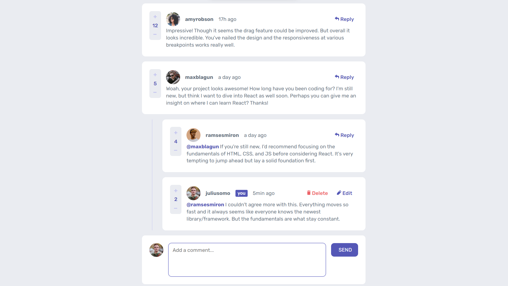

# Frontend Mentor - Interactive comments section solution

This is a solution to the [Interactive comments section challenge on Frontend Mentor](https://www.frontendmentor.io/challenges/interactive-comments-section-iG1RugEG9). Frontend Mentor challenges help you improve your coding skills by building realistic projects.

## Table of contents

- [Frontend Mentor - Interactive comments section solution](#frontend-mentor---interactive-comments-section-solution)
  - [Table of contents](#table-of-contents)
  - [Overview](#overview)
    - [The challenge](#the-challenge)
    - [Screenshot](#screenshot)
    - [Links](#links)
  - [My process](#my-process)
    - [Built with](#built-with)
    - [What I learned](#what-i-learned)
    - [Useful resources](#useful-resources)
  - [Author](#author)

## Overview

### The challenge

Users should be able to:

- View the optimal layout for the app depending on their device's screen size
- See hover states for all interactive elements on the page
- Create, Read, Update, and Delete comments and replies
- Upvote and downvote comments
- **Bonus**: If you're building a purely front-end project, use `localStorage` to save the current state in the browser that persists when the browser is refreshed.
- **Bonus**: Instead of using the `createdAt` strings from the `data.json` file, try using timestamps and dynamically track the time since the comment or reply was posted.

### Screenshot



### Links

- Solution URL: [Add solution URL here](https://your-solution-url.com)
- Live Site URL: [Add live site URL here](https://your-live-site-url.com)

## My process

### Built with

- Semantic HTML5 markup
- CSS custom properties
- Flexbox
- Desktop-first workflow
- For the Backend:

  - [Node.js](https://nodejs.org/fr) - Javascript runtime environment
  - [Express.js](https://expressjs.com/) - React framework
  - [express-async-handler](https://www.npmjs.com/package/express-async-handler) - Simple middleware for handling exceptions inside of async express routes and passing them to your express error handlers
  - [Morgan](https://www.npmjs.com/package/morgan) - HTTP request logger middleware for Node.js
  - [MongoDB](https://www.mongodb.com/en-us/atlas) Integrated suite of cloud database and data services
  - [Mongoose](https://mongoosejs.com/docs/guide.html) mongodb object modeling for node.js

- For the Frontend:

  - [Vite + Plugin React](https://vitejs.dev/) - Development environment + JavaScript library
  - [React-router 6](https://reactrouter.com/en/main) - Client side routing
  - [Redux-toolkit / RTK Query](https://redux-toolkit.js.org/rtk-query/overview) - Predictable State Container for JavaScript Apps toolset / Powerful data fetching and caching tool
  - [Material UI](https://mui.com/material-ui/react-dialog/) - Delete dialog box with customized styles
  - [TypeScript](https://www.typescriptlang.org/docs/) - JavaScript with syntax for types
  - [moment](https://momentjs.com/) - Used for for comments elapsed time since creation
    To launch backend and frontend with one command line:

  - [concurrently](https://www.npmjs.com/package/concurrently) - Run multiple commands concurrently

### What I learned

- This project has been **really challenging**
- The result is a **full-stack** comments section, fully **responsive** and **interactive**. As a bonus, the **time** since the comment or reply was posted is also **dynamic**

- The current user can:

  - **read** and **write** comments and replies from **others**,
  - **upvote** or **downvote** comments & replies,
  - **send** replies to comments **and replies**,
  - **edit**, **update** or **delete** his **own** comments and replies

- Finally, I made it on my own, **without any help**, from start to finish
- It has given me the opportunity to learn **Redux-toolkit / RTK Query** with **Typescript** & **Material UI**
- I am proud of the structure I have ended up with to get a code as **DRY** as possible

### Useful resources

All the documentation listed above.

**POV**: **Redux-toolkit / RTK Query** is not the clearest one even if you are a Redux expert 😉

**IMPORTANT**:
To be sure that **Immer** will work properly with **RTK Query**, create or add to your `.eslintrc.cjs` file:

```
overrides: [
  {
    files: ['src/features/api/*.slice.ts'],
    / avoid state param assignment
    rules: { 'no-param-reassign': ['error', { props: false }] },
      }
]
```

<em>Feel free to replace</em> `['src/features/api/*.slice.ts']` <em>with your preferred file pattern - eg. 'src/\**/*Slice.ts'</em>

## Author

- English porfolio - [Catevika Portfolio EN](catevika.github.io/Catevika_Portfolio-EN/)
- French Portfolio - [Catevika Portfolio FR](catevika.github.io/Catevika_Portfolio-FR/)
- Frontend Mentor - [@Catevika](https://www.frontendmentor.io/profile/Catevika)
- Twitter - [@dominique_bello](https://twitter.com/dominique_bello)
